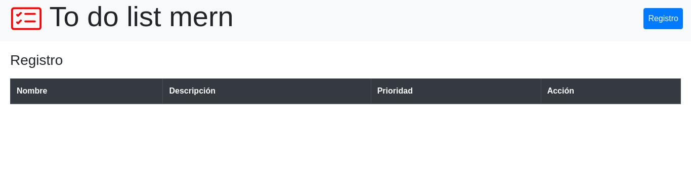
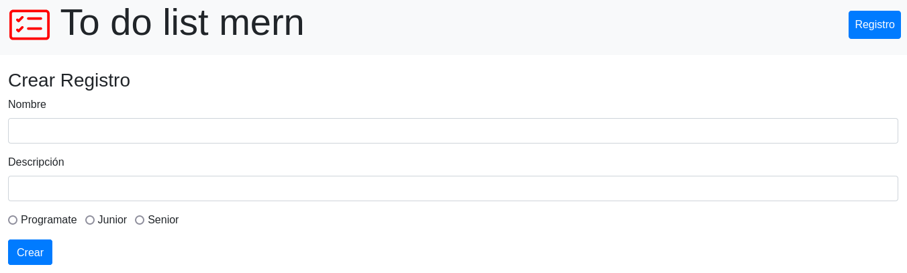
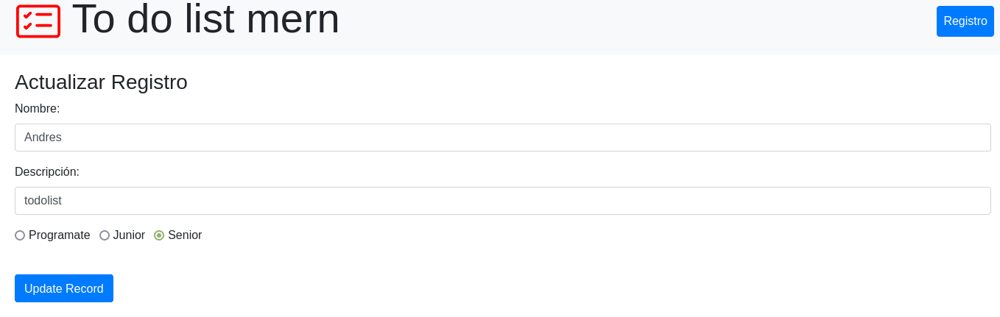
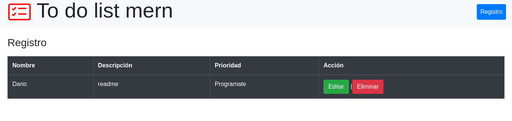

# todo list MERN

---


---



---



---



---

## Instalación

Crear Atlas URI con estos parametros `mern/server/config.env` Atlas URI:
```
ATLAS_URI=mongodb+srv://<username>:<password>@sandbox.jadwj.mongodb.net/myFirstDatabase?retryWrites=true&w=majority
PORT=5000
```
Instalar dependencias:
```
cd mern/server
npm install
npm start
```

Instalar dependencias del Web server
```
cd mern/client
npm install
npm start
```

#### Tecnologías:

- react
- node
- ATLAS MONGODB
- EXPRESS

---

#### recursos:
      mongodb university.


[](https://github.com/dariohimo)

---
____
## [Darío Higuera Moreno](https://github.com/dariohimo)
&copy; Abril 03 de 2022


